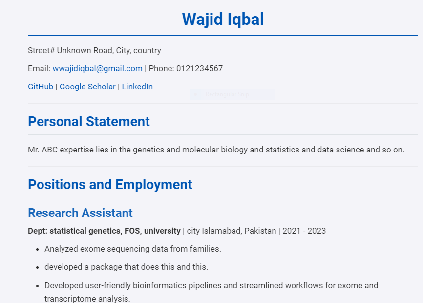

# CV-Template

This repository contains the a dummy CV of Wajid iqbal, created using Quarto. The CV is available in html.

## Project Structure

-   `CV-template.qmd`: The main Quarto document containing the content of the CV.

-   `styles.css`: The CSS file for styling the HTML version of the CV.

